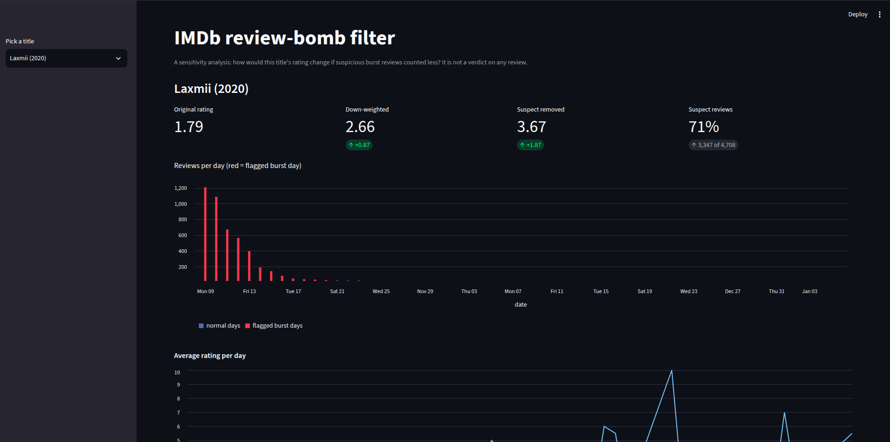
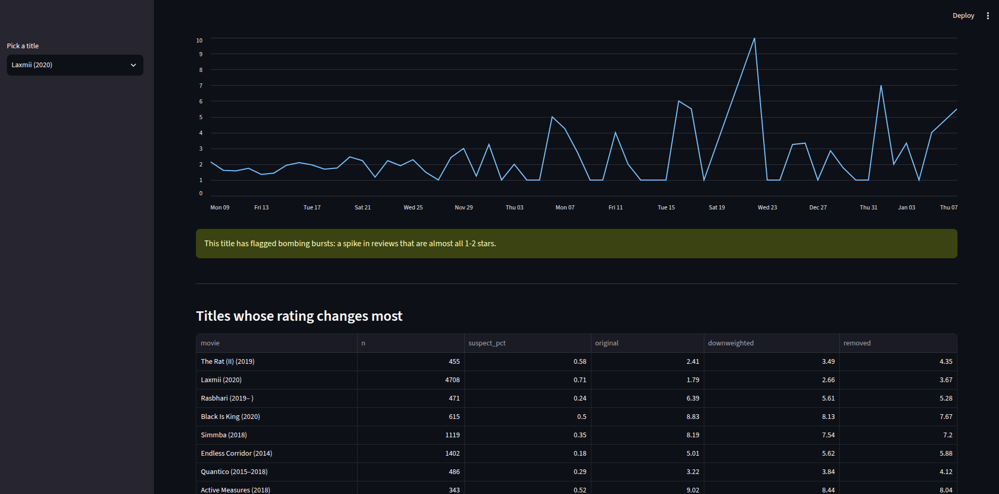

# IMDb review-bomb filter

How much would a title's rating change if suspicious burst reviews counted less?

Some titles get a flood of 1-star (or 10-star) reviews in a few days. This project
finds those bursts in a large sample of IMDb reviews, flags the reviews that look
like part of them, and reports the rating as a **range** instead of a single number:
original, down-weighted, and with suspect reviews removed.

It is a sensitivity analysis, not a fake-review detector. There are no verified
fake reviews in the data, so nothing here claims accuracy.




## Results

Ratings below are averages of the reviews in the dataset sample, not IMDb's official scores.

| Title | Original | Down-weighted | Suspect removed | Suspect share |
|---|---|---|---|---|
| Laxmii (2020) | 1.79 | 2.66 | 3.67 | 71% |
| Coolie No. 1 (2020) | 1.40 | 1.71 | 1.96 | 59% |
| Dil Bechara (2020) | 9.70 | 9.32 | 8.76 | 77% |
| Tenet (2020), control | 6.28 | 6.28 | 6.28 | 0% |
| Wonder Woman 1984 (2020), control | 4.00 | 4.00 | 4.00 | 0% |

Tenet had no burst, and Wonder Woman 1984 had a sharp rating drop that did not
look like a bombing (about 30% 1-star, below the threshold), so neither is adjusted.

## Sensitivity to thresholds

I reran the flagging with three strictness levels (loose, default, strict share
thresholds) and three `SHIFT` values. Cells show suspect share / down-weighted rating
(shift 0.3 shown, since the share thresholds already dominate and `SHIFT` changed
almost nothing).

| Setting | Flagged title-days | Laxmii | Coolie No. 1 | Dil Bechara | Tenet | WW84 |
|---|---|---|---|---|---|---|
| loose | 1215 | 71% / 2.66 | 59% / 1.71 | 80% / 9.29 | 0% / 6.28 | 0% / 4.00 |
| default | 761 | 71% / 2.66 | 59% / 1.71 | 77% / 9.32 | 0% / 6.28 | 0% / 4.00 |
| strict | 393 | 71% / 2.65 | 59% / 1.71 | 64% / 9.44 | 0% / 6.28 | 0% / 4.00 |

The bombing cases and both controls are stable across settings. The inflation case
(Dil Bechara) changes in size but not in direction. These titles are the clearest
cases, so this does not show that borderline titles are stable.

## How it works

1. **`prepare.py`**: streams the large JSON files in batches and cleans them
   (ratings, dates, helpful votes, title and year). The review text is stored
   separately so it never has to sit in memory.
2. **`bursts.py`**: builds a title-by-day table and flags days with unusually high
   review volume where at least 70% of ratings are 1-2 stars (bomb) or at least 85%
   are 9-10 stars (inflate). Share thresholds are compared against a *global*
   baseline, because a title's own median is already contaminated when most of its
   reviews arrive during the burst.
3. **`features.py`**: attaches burst flags to each review and builds reviewer
   features (number of reviews, one-shot account).
4. **`adjust.py`**: a review is suspect only if it is on a flagged day, its author has
   2 or fewer rated reviews, and its rating points the same way as the burst. Each title
   gets three numbers: original, down-weighted (suspect reviews count 25%), and removed.
5. **`app.py`**: Streamlit dashboard with a title picker, the three ratings, a
   reviews-per-day timeline with burst days highlighted, and a table of titles that change most.

## Findings and limits

- Burst timing plus reviewer history separates obvious cases well. Reviewers on bomb
  days are about 78% one-shot accounts, against about 31% on normal days.
- **A text classifier did not work as hoped.** I trained one on weak labels (burst-day
  one-shot reviews vs established reviewers' reviews). Held-out scores looked high, but
  the groups differed by film, language and reviewer type, so the model was not learning
  bombing. `labels.py` and `model.py` are kept as a documented experiment and are not
  part of the final rating.
- Inflation bursts are weaker evidence than bombing bursts. Acclaimed titles also get
  waves of 10-star reviews, so the dashboard calls them enthusiasm bursts.
- First-time reviewers can be genuine, so the suspect share is an upper bound.
- Only part of the dataset is used (4 of 6 files), limited by laptop memory.
- A rating drop without a clear burst, such as a polarizing film, is not flagged.

## Run it

Download the Kaggle IMDb reviews dataset (JSON parts) and put the files in `data/`
as `part-01.json`, `part-02.json`, and so on.
https://www.kaggle.com/datasets/ebiswas/imdb-review-dataset

```bash
python3 -m venv .venv
source .venv/bin/activate
pip install -r requirements.txt

python prepare.py
python bursts.py
python features.py
python adjust.py
streamlit run app.py
```

`prepare.py` reads the first `MAX_FILES` parts (default 3, I ran with 4), so raise
that number only if you have the memory.

## Project layout

```
prepare.py       clean and cache the raw data
explore.py       daily rating charts for any title
bursts.py        detect burst days per title
features.py      reviewer features and per-review burst flags
adjust.py        adjusted ratings per title
sensitivity.py   re-run flagging with different thresholds
app.py           Streamlit dashboard
labels.py        weak labels (experiment)
model.py         text model (experiment)
NOTES.md         running notes on findings
```